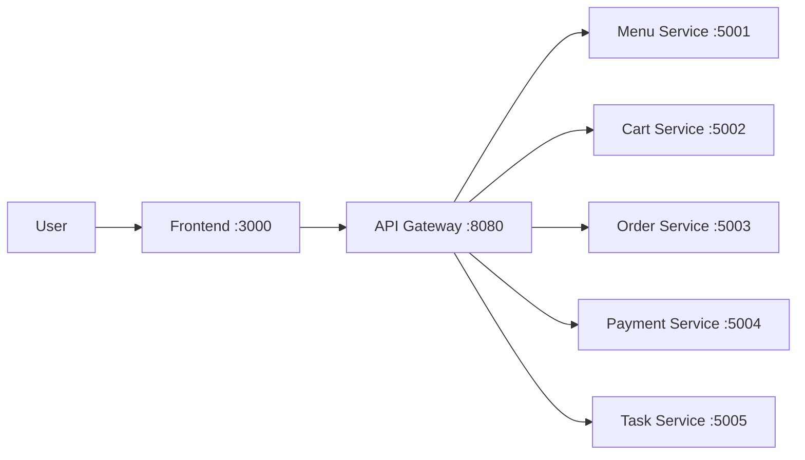

# Project Name

[](https://github.com/hungdn1701/microservices-assignment-starter/stargazers)
[](https://github.com/hungdn1701/microservices-assignment-starter/network/members)
[](LICENSE)

> Demo tự động hóa quy trình đặt món ăn theo kiến trúc hướng dịch vụ, sử dụng Spring Boot microservices, Nginx API gateway và MySQL (database per service).

> **New to this repo?** See [`GETTING_STARTED.md`](GETTING_STARTED.md) for setup instructions and workflow guide.

---

## Team Members

| Name | Student ID | Role | Contribution |
| ---- | ---------- | ---- | ------------ |
|      |            |      |              |
|      |            |      |              |
|      |            |      |              |

---

## Business Process

Đặt món ăn và thanh toán theo 2 luồng chính:

- Luồng nhanh: chọn món -> tạo đơn -> thanh toán ngay.
- Luồng giỏ hàng: chọn món -> thêm vào giỏ -> cập nhật số lượng -> checkout -> thanh toán.

Tác nhân: người dùng, frontend, API gateway, các domain service (menu/cart/order/payment) và task service (orchestrator).

Phạm vi: từ lúc chọn món đến khi đơn được cập nhật trạng thái thanh toán.

---

## Architecture



| Component           | Responsibility                                  | Tech Stack                | Port |
| ------------------- | ----------------------------------------------- | ------------------------- | ---- |
| **Frontend**        | Hiển thị giao diện menu/giỏ hàng/checkout       | Nginx + HTML/CSS/JS       | 3000 |
| **Gateway**         | Định tuyến các API `/api/*` đến backend service | Nginx                     | 8080 |
| **Menu Service**    | Cung cấp danh sách món                          | Spring Boot + JPA + MySQL | 5001 |
| **Cart Service**    | Quản lý giỏ hàng và xử lý checkout request      | Spring Boot + JPA + MySQL | 5002 |
| **Order Service**   | Tạo đơn và cập nhật trạng thái đơn              | Spring Boot + JPA + MySQL | 5003 |
| **Payment Service** | Xử lý thanh toán và lưu kết quả                 | Spring Boot + JPA + MySQL | 5004 |
| **Task Service**    | Điều phối Saga checkout và tra cứu trạng thái   | Spring Boot               | 5005 |

> Full documentation: [`docs/architecture.md`](docs/architecture.md) · [`docs/analysis-and-design.md`](docs/analysis-and-design.md)

---

## Getting Started

```bash
# Clone and initialize
git clone <your-repo-url>
cd <project-folder>
cp .env.example .env

# Build and run
docker compose up --build
```

### Verify

```bash
curl http://localhost:8080/health   # Gateway
curl http://localhost:5001/health   # Menu Service
curl http://localhost:5002/health   # Cart Service
curl http://localhost:5003/health   # Order Service
curl http://localhost:5004/health   # Payment Service
curl http://localhost:5005/health   # Task Service
```

---

## API Documentation

- [Menu Service — OpenAPI Spec](docs/api-specs/menu-service.yaml)
- [Cart Service — OpenAPI Spec](docs/api-specs/cart-service.yaml)
- [Order Service — OpenAPI Spec](docs/api-specs/order-service.yaml)
- [Payment Service — OpenAPI Spec](docs/api-specs/payment-service.yaml)
- [Task Service — OpenAPI Spec](docs/api-specs/task-service.yaml)

---

## License

This project uses the [MIT License](LICENSE).

> Template by [Hung Dang](https://github.com/hungdn1701) · [Template guide](GETTING_STARTED.md)
