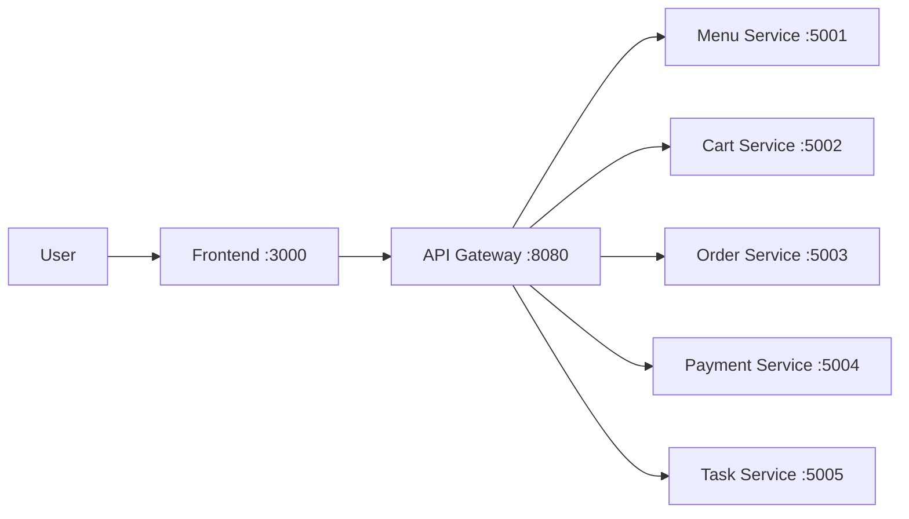

# Food Ordering SOA Demo

[](https://github.com/hungdn1701/microservices-assignment-starter/stargazers)
[](https://github.com/hungdn1701/microservices-assignment-starter/network/members)
[](LICENSE)

> Service-oriented food ordering demo using Spring Boot microservices, Nginx API gateway, and MySQL (database per service).

> **New to this repo?** See [`GETTING_STARTED.md`](GETTING_STARTED.md) for setup instructions and workflow guide.

---

## Team Members

| Name | Student ID | Role | Contribution |
| ---- | ---------- | ---- | ------------ |
|      |            |      |              |
|      |            |      |              |
|      |            |      |              |

---

## Business Process

Domain: food ordering and checkout.

Actors:

- End user (web frontend)
- API gateway
- Domain services (menu, cart, order, payment)
- Task service (orchestrator)

Supported flows:

1. Quick flow: select item -> create order -> pay immediately.
2. Cart flow: select item -> add to cart -> update quantity -> checkout -> payment.

Checkout orchestration uses synchronous REST Saga in Task Service:

- Create order in Order Service.
- Process payment in Payment Service.
- Update order status (`PAID` or `PAYMENT_FAILED`) in Order Service.

Each service exposes `GET /health` and returns `{"status":"ok"}`.

---

## Architecture



| Component           | Responsibility                              | Tech Stack                | Port |
| ------------------- | ------------------------------------------- | ------------------------- | ---- |
| **Frontend**        | Render menu/cart/checkout UI                | Nginx + HTML/CSS/JS       | 3000 |
| **Gateway**         | Route `/api/*` to backend services          | Nginx                     | 8080 |
| **Menu Service**    | Provide menu item catalog                   | Spring Boot + JPA + MySQL | 5001 |
| **Cart Service**    | Manage cart items and checkout request      | Spring Boot + JPA + MySQL | 5002 |
| **Order Service**   | Create orders and update order status       | Spring Boot + JPA + MySQL | 5003 |
| **Payment Service** | Process payment and persist result          | Spring Boot + JPA + MySQL | 5004 |
| **Task Service**    | Orchestrate checkout Saga and status lookup | Spring Boot               | 5005 |

> Full documentation: [`docs/architecture.md`](docs/architecture.md) · [`docs/analysis-and-design.md`](docs/analysis-and-design.md)

---

## Getting Started

```bash
# Clone and initialize
git clone <your-repo-url>
cd <project-folder>
cp .env.example .env

# Build and run
docker compose up --build
```

### Verify

```bash
curl http://localhost:8080/health
curl http://localhost:5001/health
curl http://localhost:5002/health
curl http://localhost:5003/health
curl http://localhost:5004/health
curl http://localhost:5005/health
```

Gateway API checks:

```bash
curl http://localhost:8080/api/menu/menu/items
curl http://localhost:8080/api/cart/cart
```

Open frontend: `http://localhost:3000`

---

## API Documentation

- [Menu Service — OpenAPI Spec](docs/api-specs/menu-service.yaml)
- [Cart Service — OpenAPI Spec](docs/api-specs/cart-service.yaml)
- [Order Service — OpenAPI Spec](docs/api-specs/order-service.yaml)
- [Payment Service — OpenAPI Spec](docs/api-specs/payment-service.yaml)
- [Task Service — OpenAPI Spec](docs/api-specs/task-service.yaml)

Detailed design docs:

- [Analysis and Design](docs/analysis-and-design.md)
- [Architecture](docs/architecture.md)

---

## License

This project uses the [MIT License](LICENSE).

> Template by [Hung Dang](https://github.com/hungdn1701) · [Template guide](GETTING_STARTED.md)
