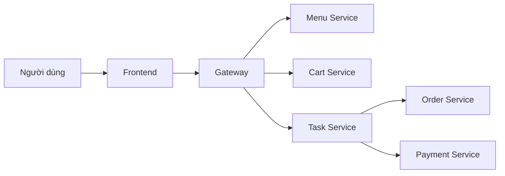
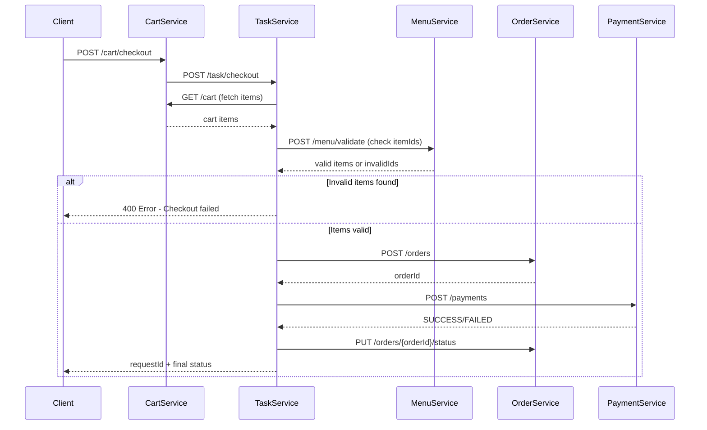
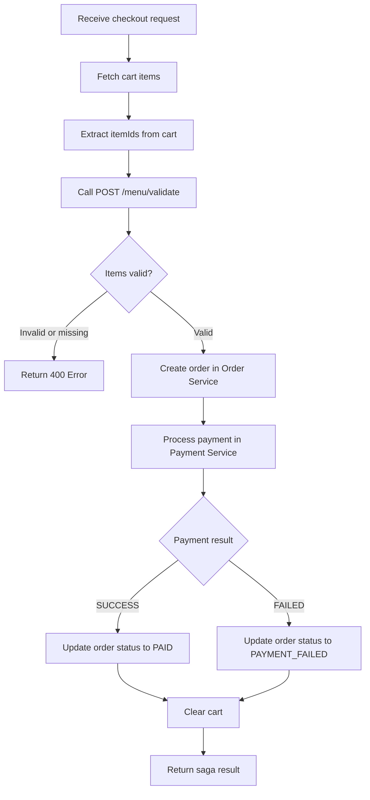

# Analysis and Design — Business Process Automation Solution

> **Goal**: Analyze a specific business process and design a service-oriented automation solution (SOA/Microservices).
> Scope: 4–6 week assignment — focus on **one business process**, not an entire system.

**References:**

1. _Service-Oriented Architecture: Analysis and Design for Services and Microservices_ — Thomas Erl (2nd Edition)
2. _Microservices Patterns: With Examples in Java_ — Chris Richardson
3. _Bài tập — Phát triển phần mềm hướng dịch vụ_ — Hung Dang (available in Vietnamese)

---

## Part 1 — Analysis Preparation

### 1.1 Business Process Definition

Describe or diagram the high-level Business Process to be automated.

- **Domain**: Đặt món ăn và thanh toán
- **Business Process**: Người dùng xem menu, quản lý giỏ hàng, tạo đơn, thanh toán và theo dõi trạng thái xử lý
- **Actors**: Người dùng, Frontend, API Gateway, Menu Service, Cart Service, Order Service, Payment Service, Task Service
- **Scope**: Từ thao tác chọn món đến khi đơn hàng được cập nhật trạng thái thanh toán cuối cùng

**Process Diagram:**

### 1.2 Existing Automation Systems

List existing systems, databases, or legacy logic related to this process.

| System Name  | Type          | Current Role                                             | Interaction Method |
| ------------ | ------------- | -------------------------------------------------------- | ------------------ |
| Frontend SPA | Web UI        | Giao diện cho người dùng thao tác menu/giỏ hàng/checkout | HTTP qua Gateway   |
| API Gateway  | Reverse Proxy | Điểm vào duy nhất cho backend APIs                       | Proxy REST         |
| Menu DB      | MySQL         | Lưu dữ liệu menu                                         | JDBC/JPA           |
| Cart DB      | MySQL         | Lưu dữ liệu giỏ hàng                                     | JDBC/JPA           |
| Order DB     | MySQL         | Lưu dữ liệu đơn hàng                                     | JDBC/JPA           |
| Payment DB   | MySQL         | Lưu dữ liệu thanh toán                                   | JDBC/JPA           |

> If none exist, state: _"None — the process is currently performed manually."_

### 1.3 Non-Functional Requirements

Non-functional requirements serve as input for identifying Utility Service and Microservice Candidates in step 2.7.

| Requirement  | Description                                                                       |
| ------------ | --------------------------------------------------------------------------------- |
| Performance  | API phản hồi nhanh cho demo local, mục tiêu P95 dưới 300ms với tác vụ CRUD cơ bản |
| Security     | Không hardcode secrets; cấu hình bằng biến môi trường trong `.env` và compose     |
| Scalability  | Tách service theo miền nghiệp vụ để có thể mở rộng độc lập                        |
| Availability | Mỗi service có `GET /health`; database có healthcheck khi khởi chạy compose       |

---

## Part 2 — REST/Microservices Modeling

### 2.1 Decompose Business Process & 2.2 Filter Unsuitable Actions

Decompose the process from 1.1 into granular actions. Mark actions unsuitable for service encapsulation.

| #   | Action                  | Actor | Description                                  | Suitable? |
| --- | ----------------------- | ----- | -------------------------------------------- | --------- |
| 1   | View menu               | User  | Lấy danh sách món đang phục vụ               | ✅        |
| 2   | Add item to cart        | User  | Thêm món vào giỏ hàng với số lượng           | ✅        |
| 3   | Update cart quantity    | User  | Tăng/giảm số lượng món trong giỏ             | ✅        |
| 4   | Remove item from cart   | User  | Xóa món khỏi giỏ hàng                        | ✅        |
| 5   | Checkout                | User  | Gửi thông tin nhận hàng và bắt đầu xử lý đơn | ✅        |
| 6   | Manual payment approval | Staff | Duyệt thanh toán thủ công ngoài hệ thống     | ❌        |

> Actions marked ❌: manual-only, require human judgment, or cannot be encapsulated as a service.

### 2.3 Entity Service Candidates

Identify business entities and group reusable (agnostic) actions into Entity Service Candidates.

| Entity   | Service Candidate | Agnostic Actions                         |
| -------- | ----------------- | ---------------------------------------- |
| MenuItem | Menu Service      | Liệt kê món ăn                           |
| CartItem | Cart Service      | Thêm/sửa/xóa item giỏ hàng, lấy giỏ hàng |
| Order    | Order Service     | Tạo đơn hàng, cập nhật trạng thái đơn    |
| Payment  | Payment Service   | Xử lý thanh toán, lưu kết quả thanh toán |

### 2.4 Task Service Candidate

Group process-specific (non-agnostic) actions into a Task Service Candidate.

| Non-agnostic Action                 | Task Service Candidate           |
| ----------------------------------- | -------------------------------- |
| Điều phối quy trình checkout        | Task Service (Saga Orchestrator) |
| Đồng bộ trạng thái order và payment | Task Service (Saga Orchestrator) |

### 2.5 Identify Resources

Map entities/processes to REST URI Resources.

| Entity / Process | Resource URI                                                     |
| ---------------- | ---------------------------------------------------------------- |
| Menu             | `/menu/items`                                                    |
| Cart             | `/cart`, `/cart/items`, `/cart/items/{itemId}`, `/cart/checkout` |
| Order            | `/orders`, `/orders/{orderId}/status`                            |
| Payment          | `/payments`                                                      |
| Task             | `/task/checkout`, `/task/status/{requestId}`                     |

### 2.6 Associate Capabilities with Resources and Methods

| Service Candidate | Capability      | Resource                   | HTTP Method |
| ----------------- | --------------- | -------------------------- | ----------- |
| Menu Service      | Get menu items  | `/menu/items`              | GET         |
| Menu Service      | Validate items  | `/menu/validate`           | POST        |
| Cart Service      | Add item        | `/cart/items`              | POST        |
| Cart Service      | Get cart        | `/cart`                    | GET         |
| Cart Service      | Update quantity | `/cart/items/{itemId}`     | PUT         |
| Cart Service      | Remove item     | `/cart/items/{itemId}`     | DELETE      |
| Cart Service      | Checkout cart   | `/cart/checkout`           | POST        |
| Order Service     | Create order    | `/orders`                  | POST        |
| Order Service     | Update status   | `/orders/{orderId}/status` | PUT         |
| Payment Service   | Process payment | `/payments`                | POST        |
| Task Service      | Start saga      | `/task/checkout`           | POST        |
| Task Service      | Get saga status | `/task/status/{requestId}` | GET         |

### 2.7 Utility Service & Microservice Candidates

Based on Non-Functional Requirements (1.3) and Processing Requirements, identify cross-cutting utility logic or logic requiring high autonomy/performance.

| Candidate    | Type (Utility / Microservice) | Justification                                             |
| ------------ | ----------------------------- | --------------------------------------------------------- |
| API Gateway  | Utility                       | Tập trung định tuyến API, CORS, điểm vào thống nhất       |
| Task Service | Microservice                  | Chứa logic điều phối quy trình checkout đặc thù nghiệp vụ |

### 2.8 Service Composition Candidates

Interaction diagram showing how Service Candidates collaborate to fulfill the business process.

---

## Part 3 — Service-Oriented Design

### 3.1 Uniform Contract Design

Service Contract specification for each service. Full OpenAPI specs:

- [menu-service.yaml](api-specs/menu-service.yaml)
- [cart-service.yaml](api-specs/cart-service.yaml)
- [order-service.yaml](api-specs/order-service.yaml)
- [payment-service.yaml](api-specs/payment-service.yaml)
- [task-service.yaml](api-specs/task-service.yaml)

**Menu Service:**

| Endpoint         | Method | Media Type       | Response Codes |
| ---------------- | ------ | ---------------- | -------------- |
| `/menu/items`    | GET    | application/json | 200, 400       |
| `/menu/validate` | POST   | application/json | 200, 400       |

**Cart Service:**

| Endpoint               | Method | Media Type       | Response Codes |
| ---------------------- | ------ | ---------------- | -------------- |
| `/cart`                | GET    | application/json | 200            |
| `/cart/items`          | POST   | application/json | 201, 400       |
| `/cart/items/{itemId}` | PUT    | application/json | 200, 400, 404  |
| `/cart/items/{itemId}` | DELETE | application/json | 204, 404       |
| `/cart/checkout`       | POST   | application/json | 202, 400       |

**Order Service:**

| Endpoint                   | Method | Media Type       | Response Codes |
| -------------------------- | ------ | ---------------- | -------------- |
| `/orders`                  | POST   | application/json | 201, 400       |
| `/orders/{orderId}/status` | PUT    | application/json | 200, 400, 404  |

**Payment Service:**

| Endpoint    | Method | Media Type       | Response Codes |
| ----------- | ------ | ---------------- | -------------- |
| `/payments` | POST   | application/json | 200, 400       |

**Task Service:**

| Endpoint                   | Method | Media Type       | Response Codes |
| -------------------------- | ------ | ---------------- | -------------- |
| `/task/checkout`           | POST   | application/json | 202, 400       |
| `/task/status/{requestId}` | GET    | application/json | 200, 404       |

### 3.2 Service Logic Design

Internal processing flow for each service.

**Task Service (Checkout Saga):**

**Validation Step Detail (using POST /menu/validate):**

- Task Service gửi danh sách `itemIds` từ giỏ hàng sang Menu Service
- Menu Service kiểm tra xem mỗi item còn tồn tại trong menu không
- Nếu item nào không hợp lệ hoặc không tìm thấy → trả về `invalidIds` list và reject checkout
- Nếu tất cả hợp lệ → tiếp tục quy trình tạo đơn và thanh toán
