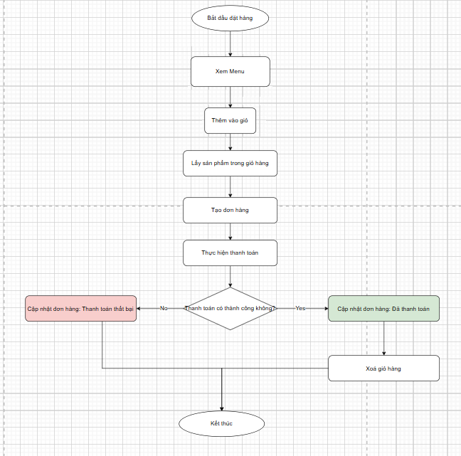
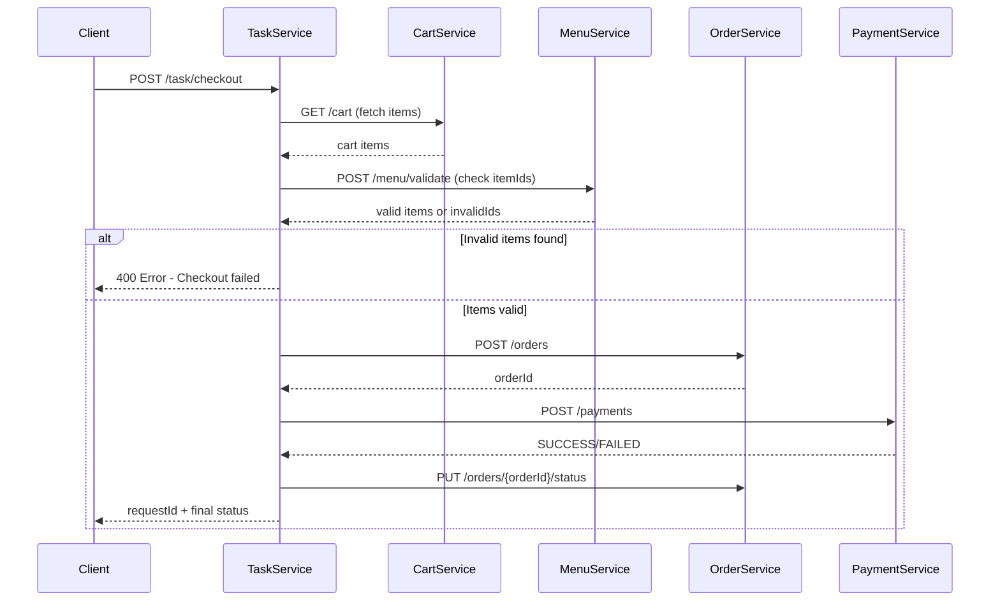
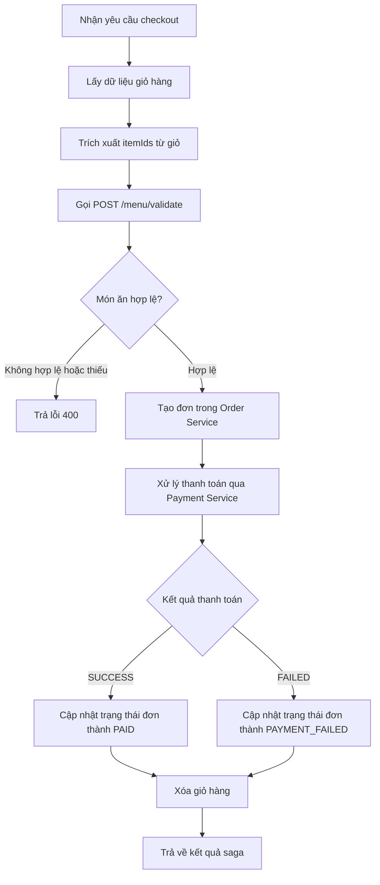
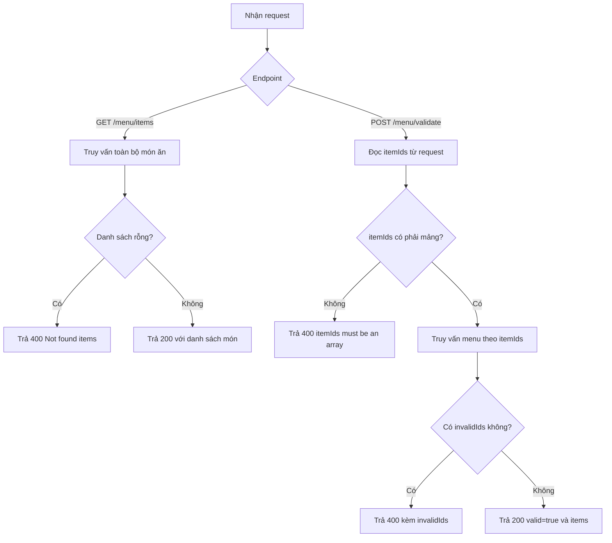
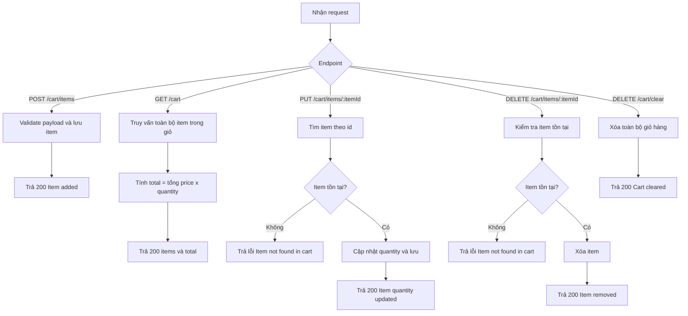
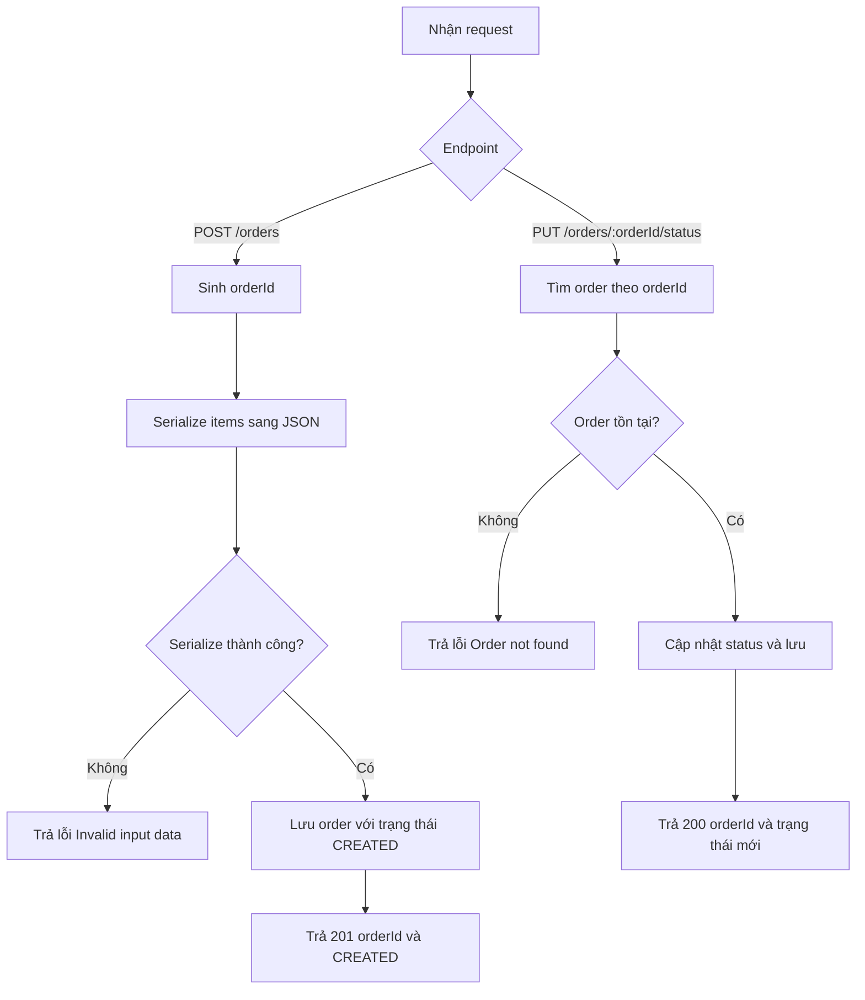
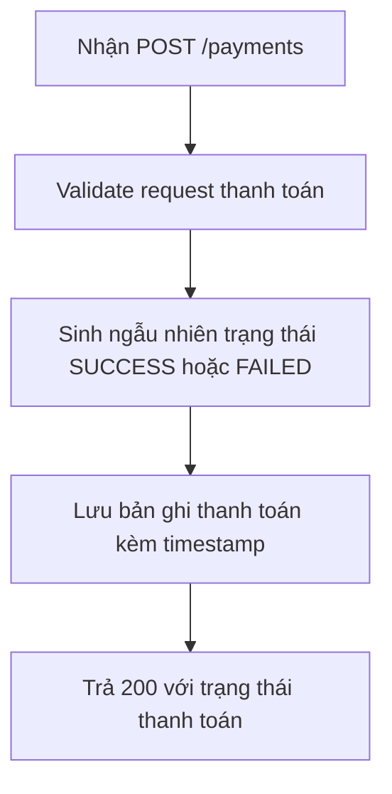

# Analysis and Design — Business Process Automation Solution

> **Goal**: Analyze a specific business process and design a service-oriented automation solution (SOA/Microservices).
> Scope: 4–6 week assignment — focus on **one business process**, not an entire system.

**References:**

1. _Service-Oriented Architecture: Analysis and Design for Services and Microservices_ — Thomas Erl (2nd Edition)
2. _Microservices Patterns: With Examples in Java_ — Chris Richardson
3. _Bài tập — Phát triển phần mềm hướng dịch vụ_ — Hung Dang (available in Vietnamese)

---

## Part 1 — Analysis Preparation

### 1.1 Business Process Definition

Describe or diagram the high-level Business Process to be automated.

- **Domain**: Đặt món ăn và thanh toán
- **Business Process**: Người dùng xem menu, quản lý giỏ hàng, tạo đơn, thanh toán và theo dõi trạng thái xử lý
- **Actors**: Khách hàng (Đặt hàng), Hệ thống (Xử lý đơn đặt hàng thông qua công cụ điều phối)
- **Scope**:
  - **In-Scope**: Khách hàng đặt món ăn. Hệ thống tiếp nhận đơn đặt , xử lý đơn đặt món
  - **Out-of-Scope**: Khách hàng nhận đơn hàng. Quy trình giao hàng

**Process Diagram:**

### 1.2 Existing Automation Systems

> None — the process is currently performed manually.

### 1.3 Non-Functional Requirements

Non-functional requirements serve as input for identifying Utility Service and Microservice Candidates in step 2.7.

| Requirement  | Description                                                                       |
| ------------ | --------------------------------------------------------------------------------- |
| Performance  | API phản hồi nhanh cho demo local, mục tiêu P95 dưới 300ms với tác vụ CRUD cơ bản |
| Security     | Không hardcode secrets; cấu hình bằng biến môi trường trong `.env` và compose     |
| Scalability  | Tách service theo miền nghiệp vụ để có thể mở rộng độc lập                        |
| Availability | Mỗi service có `GET /health`; database có healthcheck khi khởi chạy compose       |

---

## Part 2 — REST/Microservices Modeling

### 2.1 Decompose Business Process & 2.2 Filter Unsuitable Actions

Decompose the process from 1.1 into granular actions. Mark actions unsuitable for service encapsulation.

| #   | Action                                      | Actor    | Description                                                     | Suitable? |
| --- | ------------------------------------------- | -------- | --------------------------------------------------------------- | --------- |
| 1   | Nhận yêu cầu checkout                       | Hệ thống | Nhận phone và address từ request checkout                       | ✅        |
| 2   | Lấy dữ liệu giỏ hàng                        | Hệ thống | Gọi Cart Service để lấy danh sách món trong giỏ                 | ✅        |
| 3   | Nếu giỏ hàng rỗng, từ chối yêu cầu          | Hệ thống | Không có dữ liệu item để tạo đơn, trả lỗi và kết thúc quy trình | ✅        |
| 4   | Trích xuất itemIds từ giỏ hàng              | Hệ thống | Chuẩn hóa dữ liệu item trước khi xác thực menu                  | ✅        |
| 5   | Xác thực món ăn trong menu                  | Hệ thống | Gọi Menu Service để kiểm tra itemIds còn hợp lệ                 | ✅        |
| 6   | Nếu có món không hợp lệ, từ chối yêu cầu    | Hệ thống | Trả lỗi invalidIds, kết thúc quy trình                          | ✅        |
| 7   | Tính tổng tiền đơn hàng                     | Hệ thống | Tính tổng giá dựa trên price x quantity của cart items          | ✅        |
| 8   | Nếu tổng tiền không hợp lệ, từ chối yêu cầu | Hệ thống | Tổng tiền <= 0, trả lỗi và kết thúc quy trình                   | ✅        |
| 9   | Tạo đơn hàng                                | Hệ thống | Gọi Order Service tạo order mới từ các món đã xác thực          | ✅        |
| 10  | Nếu tạo đơn thất bại, từ chối yêu cầu       | Hệ thống | Không tạo được orderId, trả lỗi và kết thúc quy trình           | ✅        |
| 11  | Gửi yêu cầu thanh toán                      | Hệ thống | Gọi Payment Service để xử lý thanh toán cho order               | ✅        |
| 12  | Nhận kết quả thanh toán                     | Hệ thống | Nhận trạng thái SUCCESS hoặc FAILED từ Payment Service          | ✅        |
| 13  | Cập nhật trạng thái đơn hàng                | Hệ thống | Cập nhật order thành PAID hoặc PAYMENT_FAILED                   | ✅        |
| 14  | Xóa giỏ hàng sau thanh toán thành công      | Hệ thống | Gọi Cart Service clear cart để hoàn tất quy trình               | ✅        |
| 15  | Trả về kết quả xử lý                        | Hệ thống | Trả requestId và trạng thái hiện tại cho client                 | ✅        |
| 16  | Tra cứu trạng thái xử lý                    | User     | Gọi API status theo requestId để theo dõi tiến trình            | ✅        |
| 17  | Manual payment approval                     | Staff    | Duyệt thanh toán thủ công ngoài hệ thống tự động                | ❌        |

> Actions marked ❌: manual-only, require human judgment, or cannot be encapsulated as a service.

### 2.3 Entity Service Candidates

Identify business entities and group reusable (agnostic) actions into Entity Service Candidates.

| Entity   | Service Candidate | Agnostic Actions (from 2.1)                                                                                         |
| -------- | ----------------- | ------------------------------------------------------------------------------------------------------------------- |
| MenuItem | Menu Service      | #5 Xác thực món ăn trong menu                                                                                       |
| CartItem | Cart Service      | #2 Lấy dữ liệu giỏ hàng ; #3 Kiểm tra giỏ rỗng ; #4 Trích xuất itemIds ; #14 Xóa giỏ hàng sau thanh toán thành công |
| Order    | Order Service     | #9 Tạo đơn hàng ; #10 Xử lý lỗi tạo đơn ; #13 Cập nhật trạng thái đơn hàng                                          |
| Payment  | Payment Service   | #11 Gửi yêu cầu thanh toán ; #12 Nhận kết quả thanh toán                                                            |

### 2.4 Task Service Candidate

Group process-specific (non-agnostic) actions into a Task Service Candidate.

| Non-agnostic Action (from 2.1)                 | Task Service Candidate           |
| ---------------------------------------------- | -------------------------------- |
| #1 Nhận yêu cầu checkout                       | Task Service (Saga Orchestrator) |
| #6 Nếu có món không hợp lệ, từ chối yêu cầu    | Task Service (Saga Orchestrator) |
| #7 Tính tổng tiền đơn hàng                     | Task Service (Saga Orchestrator) |
| #8 Nếu tổng tiền không hợp lệ, từ chối yêu cầu | Task Service (Saga Orchestrator) |
| #10 Nếu tạo đơn thất bại, từ chối yêu cầu      | Task Service (Saga Orchestrator) |
| #12 Nhận và xử lý kết quả thanh toán           | Task Service (Saga Orchestrator) |
| #13 Cập nhật trạng thái đơn hàng               | Task Service (Saga Orchestrator) |
| #15 Trả về kết quả xử lý                       | Task Service (Saga Orchestrator) |

### 2.5 Identify Resources

Map entities/processes to REST URI Resources.

| Entity / Process | Resource URI                                   |
| ---------------- | ---------------------------------------------- |
| Menu             | `/menu/items`,`/menu/validate`                 |
| Cart             | `/cart`, `/cart/items`, `/cart/items/{itemId}` |
| Order            | `/orders`, `/orders/{orderId}/status`          |
| Payment          | `/payments`                                    |
| Task             | `/task/checkout`, `/task/status/{requestId}`   |

### 2.6 Associate Capabilities with Resources and Methods

| Service Candidate | Capability      | Resource                   | HTTP Method |
| ----------------- | --------------- | -------------------------- | ----------- |
| Menu Service      | Get menu items  | `/menu/items`              | GET         |
| Menu Service      | Validate items  | `/menu/validate`           | POST        |
| Cart Service      | Add item        | `/cart/items`              | POST        |
| Cart Service      | Get cart        | `/cart`                    | GET         |
| Cart Service      | Update quantity | `/cart/items/{itemId}`     | PUT         |
| Cart Service      | Remove item     | `/cart/items/{itemId}`     | DELETE      |
| Order Service     | Create order    | `/orders`                  | POST        |
| Order Service     | Update status   | `/orders/{orderId}/status` | PUT         |
| Payment Service   | Process payment | `/payments`                | POST        |
| Task Service      | Start saga      | `/task/checkout`           | POST        |
| Task Service      | Get saga status | `/task/status/{requestId}` | GET         |

### 2.7 Utility Service & Microservice Candidates

Based on Non-Functional Requirements (1.3) and Processing Requirements, identify cross-cutting utility logic or logic requiring high autonomy/performance.

| Candidate    | Type (Utility / Microservice) | Justification                                             |
| ------------ | ----------------------------- | --------------------------------------------------------- |
| API Gateway  | Utility                       | Tập trung định tuyến API, CORS, điểm vào thống nhất       |
| Task Service | Microservice                  | Chứa logic điều phối quy trình checkout đặc thù nghiệp vụ |

### 2.8 Service Composition Candidates

Interaction diagram showing how Service Candidates collaborate to fulfill the business process.

---

## Part 3 — Service-Oriented Design

### 3.1 Uniform Contract Design

Service Contract specification for each service. Full OpenAPI specs:

- [menu-service.yaml](api-specs/menu-service.yaml)
- [cart-service.yaml](api-specs/cart-service.yaml)
- [order-service.yaml](api-specs/order-service.yaml)
- [payment-service.yaml](api-specs/payment-service.yaml)
- [task-service.yaml](api-specs/task-service.yaml)

**Menu Service:**

| Endpoint         | Method | Media Type       | Response Codes |
| ---------------- | ------ | ---------------- | -------------- |
| `/menu/items`    | GET    | application/json | 200, 400       |
| `/menu/validate` | POST   | application/json | 200, 400       |

**Cart Service:**

| Endpoint               | Method | Media Type       | Response Codes |
| ---------------------- | ------ | ---------------- | -------------- |
| `/cart`                | GET    | application/json | 200            |
| `/cart/items`          | POST   | application/json | 201, 400       |
| `/cart/items/{itemId}` | PUT    | application/json | 200, 400, 404  |
| `/cart/items/{itemId}` | DELETE | application/json | 204, 404       |

**Order Service:**

| Endpoint                   | Method | Media Type       | Response Codes |
| -------------------------- | ------ | ---------------- | -------------- |
| `/orders`                  | POST   | application/json | 201, 400       |
| `/orders/{orderId}/status` | PUT    | application/json | 200, 400, 404  |

**Payment Service:**

| Endpoint    | Method | Media Type       | Response Codes |
| ----------- | ------ | ---------------- | -------------- |
| `/payments` | POST   | application/json | 200, 400       |

**Task Service:**

| Endpoint                   | Method | Media Type       | Response Codes |
| -------------------------- | ------ | ---------------- | -------------- |
| `/task/checkout`           | POST   | application/json | 202, 400       |
| `/task/status/{requestId}` | GET    | application/json | 200, 404       |

### 3.2 Service Logic Design

Luồng xử lý nội bộ cho từng service.

**Task Service (Checkout Saga):**

**Validation Step Detail (using POST /menu/validate):**

- Task Service gửi danh sách `itemIds` từ giỏ hàng sang Menu Service
- Menu Service kiểm tra xem mỗi item còn tồn tại trong menu không
- Nếu item nào không hợp lệ hoặc không tìm thấy → trả về `invalidIds` list và reject checkout
- Nếu tất cả hợp lệ → tiếp tục quy trình tạo đơn và thanh toán

**Menu Service:**

**Cart Service:**

**Order Service:**

**Payment Service:**

