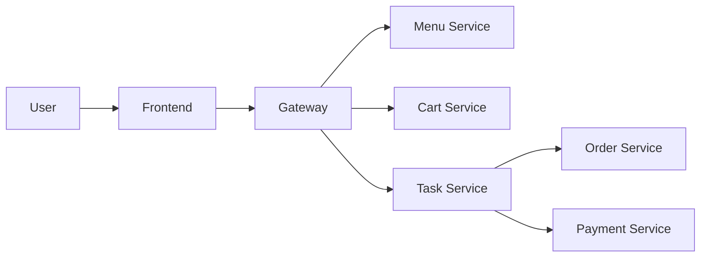
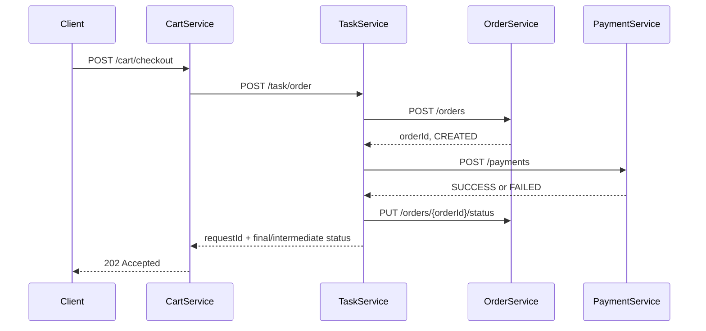
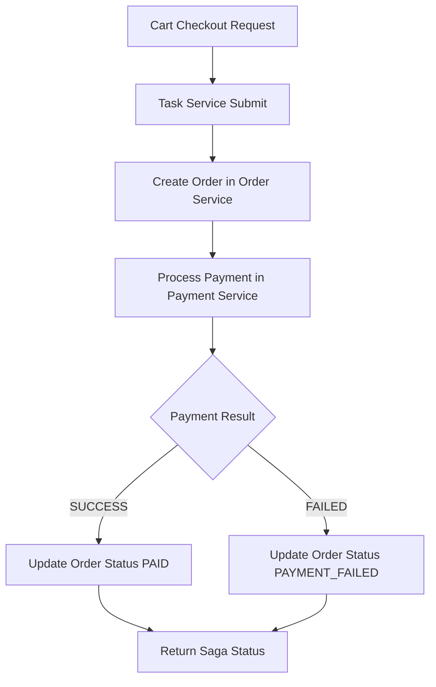

# Analysis and Design — Food Ordering SOA Demo

## Part 1 — Analysis Preparation

### 1.1 Business Process Definition

- Domain: Food ordering and checkout
- Business Process: Browse menu, manage cart, submit checkout, run payment workflow, track order status
- Actors: End User, API Gateway, Task Orchestrator, Domain Services
- Scope: End-to-end ordering flow with synchronous Saga orchestration via REST

Process overview:

### 1.2 Existing Automation Systems

| System Name       | Type          | Current Role                            | Interaction Method |
| ----------------- | ------------- | --------------------------------------- | ------------------ |
| Frontend SPA      | Web UI        | User interaction for menu/cart/checkout | HTTP via Gateway   |
| API Gateway       | Reverse proxy | Single entrypoint and routing           | REST Proxy         |
| Service Databases | MySQL         | Persistence for menu/cart/order/payment | JDBC/JPA           |

### 1.3 Non-Functional Requirements

| Requirement  | Description                                                               |
| ------------ | ------------------------------------------------------------------------- |
| Performance  | P95 API response for CRUD under 300 ms in local environment               |
| Security     | API call isolation via gateway; credentials through environment variables |
| Scalability  | Service-level decomposition enables independent scaling                   |
| Availability | DB per service and health endpoints for runtime monitoring                |

## Part 2 — REST/Microservices Modeling

### 2.1 Decompose Business Process and 2.2 Filter Unsuitable Actions

| #   | Action                   | Actor    | Description                            | Suitable? |
| --- | ------------------------ | -------- | -------------------------------------- | --------- |
| 1   | View menu                | User     | Retrieve available items               | ✅        |
| 2   | Add to cart              | User     | Add selected item with quantity        | ✅        |
| 3   | Update quantity          | User     | Change quantity in cart                | ✅        |
| 4   | Remove cart item         | User     | Remove item from cart                  | ✅        |
| 5   | Checkout                 | User     | Submit phone/address and trigger order | ✅        |
| 6   | Approve payment manually | Operator | Human approval step                    | ❌        |

### 2.3 Entity Service Candidates

| Entity   | Service Candidate | Agnostic Actions                        |
| -------- | ----------------- | --------------------------------------- |
| MenuItem | Menu Service      | List menu items                         |
| CartItem | Cart Service      | Add, update quantity, remove, list cart |
| Order    | Order Service     | Create order, update order status       |
| Payment  | Payment Service   | Process payment, store payment result   |

### 2.4 Task Service Candidate

| Non-agnostic Action                 | Task Service Candidate           |
| ----------------------------------- | -------------------------------- |
| Orchestrate checkout workflow       | Task Service (Saga Orchestrator) |
| Coordinate order and payment result | Task Service (Saga Orchestrator) |

### 2.5 Identify Resources

| Entity / Process | Resource URI                                                     |
| ---------------- | ---------------------------------------------------------------- |
| Menu             | `/menu/items`                                                    |
| Cart             | `/cart`, `/cart/items`, `/cart/items/{itemId}`, `/cart/checkout` |
| Order            | `/orders`, `/orders/{orderId}/status`                            |
| Payment          | `/payments`                                                      |
| Saga Task        | `/task/order`, `/task/status/{requestId}`                        |

### 2.6 Associate Capabilities with Resources and Methods

| Service Candidate | Capability      | Resource                   | HTTP Method |
| ----------------- | --------------- | -------------------------- | ----------- |
| Menu Service      | Get menu items  | `/menu/items`              | GET         |
| Cart Service      | Add item        | `/cart/items`              | POST        |
| Cart Service      | Get cart        | `/cart`                    | GET         |
| Cart Service      | Update quantity | `/cart/items/{itemId}`     | PUT         |
| Cart Service      | Remove item     | `/cart/items/{itemId}`     | DELETE      |
| Cart Service      | Checkout cart   | `/cart/checkout`           | POST        |
| Order Service     | Create order    | `/orders`                  | POST        |
| Order Service     | Update status   | `/orders/{orderId}/status` | PUT         |
| Payment Service   | Process payment | `/payments`                | POST        |
| Task Service      | Start saga      | `/task/order`              | POST        |
| Task Service      | Get saga status | `/task/status/{requestId}` | GET         |

### 2.7 Utility Service and Microservice Candidates

| Candidate    | Type (Utility / Microservice) | Justification                                     |
| ------------ | ----------------------------- | ------------------------------------------------- |
| API Gateway  | Utility                       | Centralized routing and CORS handling             |
| Task Service | Microservice                  | Encapsulates process-specific orchestration logic |

### 2.8 Service Composition Candidate

## Part 3 — Service-Oriented Design

### 3.1 Uniform Contract Design

OpenAPI contracts:

- [docs/api-specs/menu-service.yaml](api-specs/menu-service.yaml)
- [docs/api-specs/cart-service.yaml](api-specs/cart-service.yaml)
- [docs/api-specs/order-service.yaml](api-specs/order-service.yaml)
- [docs/api-specs/payment-service.yaml](api-specs/payment-service.yaml)
- [docs/api-specs/task-service.yaml](api-specs/task-service.yaml)

Common standards:

- JSON request/response
- Validation errors return 400 with `{"error": "..."}`
- Health endpoint for each service: `GET /health` -> `{"status":"ok"}`

### 3.2 Service Logic Design

