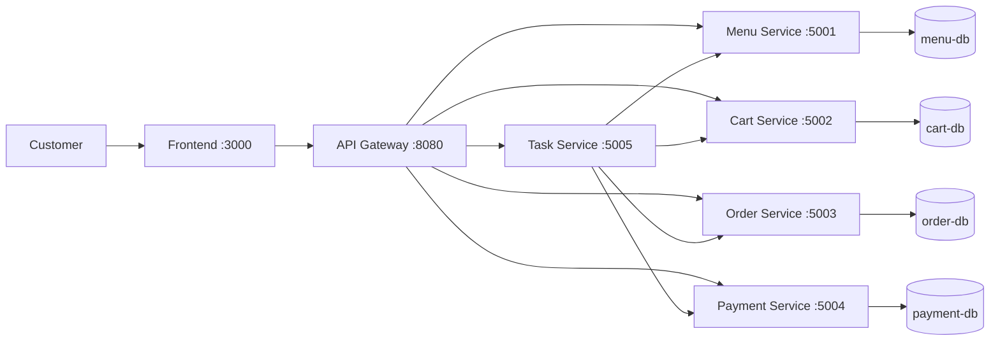

# System Architecture

> Tài liệu này được hoàn thành dựa trên kết quả phân tích từ [Analysis and Design — DDD](analysis-and-design-ddd.md).
> Hệ thống được thiết kế cho quy trình **Đặt món ăn và thanh toán trực tuyến**.

**Tài liệu tham khảo:**

1. _Service-Oriented Architecture: Analysis and Design for Services and Microservices_ — Thomas Erl (2nd Edition)
2. _Microservices Patterns: With Examples in Java_ — Chris Richardson
3. _Bài tập — Phát triển phần mềm hướng dịch vụ_ — Hung Dang (available in Vietnamese)

---

## 1. Pattern Selection

| Pattern                      | Selected? | Business/Technical Justification                                                                                                                                                                 |
| ---------------------------- | --------- | ------------------------------------------------------------------------------------------------------------------------------------------------------------------------------------------------ |
| API Gateway                  | ✅        | Tất cả request từ Frontend đi qua Gateway để định tuyến thống nhất đến backend services (`/api/menu/*`, `/api/cart/*`, `/api/order/*`, `/api/payment/*`, `/api/task/*`) và xử lý CORS tập trung. |
| Database per Service         | ✅        | Menu, Cart, Order, Payment có domain dữ liệu khác nhau; mỗi service có database riêng để giảm coupling schema và dễ mở rộng độc lập.                                                             |
| Shared Database              | ❌        | Không dùng vì làm giảm tính độc lập của service và tăng rủi ro ảnh hưởng chéo giữa các bounded context.                                                                                          |
| Saga (Orchestration)         | ✅        | Task Service đóng vai trò orchestrator điều phối checkout: đọc cart, validate menu, tạo order, gọi payment, cập nhật trạng thái order, clear cart.                                               |
| Event-driven / Message Queue | ❌        | Giai đoạn hiện tại dùng REST đồng bộ để đơn giản hóa triển khai và demo.                                                                                                                         |
| CQRS                         | ❌        | Chưa cần ở quy mô MVP; hiện tại mô hình CRUD + orchestration đã đáp ứng yêu cầu.                                                                                                                 |
| Circuit Breaker              | ❌        | Chưa triển khai ở MVP; xử lý lỗi hiện tại ở mức cơ bản qua response validation và exception handling.                                                                                            |
| Service Registry / Discovery | ❌        | Docker Compose DNS đã đủ cho phân giải tên service nội bộ (`menu-service`, `cart-service`, `order-service`, `payment-service`, `task-service`).                                                  |
| Health Check Endpoint        | ✅        | Mọi service đều expose `GET /health` để kiểm tra trạng thái và đảm bảo availability khi chạy Docker Compose.                                                                                     |

> Reference: _Microservices Patterns_ — Chris Richardson (Saga, Data Management, Communication Patterns).

---

## 2. System Components

| Component           | Responsibility                                                                | Tech Stack                 | Port            |
| ------------------- | ----------------------------------------------------------------------------- | -------------------------- | --------------- |
| **Frontend**        | Giao diện hiển thị menu, giỏ hàng, checkout và theo dõi trạng thái            | Nginx static + HTML/CSS/JS | 3000            |
| **Gateway**         | Reverse proxy định tuyến tất cả API `/api/*` đến đúng service backend         | Nginx                      | 8080            |
| **Menu Service**    | Cung cấp danh sách món ăn, validate itemIds theo menu hiện tại                | Spring Boot + JPA          | 5001            |
| **Cart Service**    | Quản lý giỏ hàng (thêm/sửa/xóa/lấy cart, clear cart)                          | Spring Boot + JPA          | 5002            |
| **Order Service**   | Tạo đơn hàng và cập nhật trạng thái đơn                                       | Spring Boot + JPA          | 5003            |
| **Payment Service** | Xử lý thanh toán và lưu kết quả thanh toán                                    | Spring Boot + JPA          | 5004            |
| **Task Service**    | Orchestrate Saga checkout và cung cấp API tra cứu trạng thái theo `requestId` | Spring Boot                | 5005            |
| **Menu DB**         | Lưu dữ liệu menu                                                              | MySQL 8.4                  | 3306 (internal) |
| **Cart DB**         | Lưu dữ liệu giỏ hàng                                                          | MySQL 8.4                  | 3306 (internal) |
| **Order DB**        | Lưu dữ liệu đơn hàng                                                          | MySQL 8.4                  | 3306 (internal) |
| **Payment DB**      | Lưu dữ liệu thanh toán                                                        | MySQL 8.4                  | 3306 (internal) |

---

## 3. Communication

### Inter-service Communication Matrix

| From -> To          | Menu Service                | Cart Service                | Order Service                | Payment Service                | Task Service                | Gateway                         | Menu DB       | Cart DB       | Order DB      | Payment DB    |
| ------------------- | --------------------------- | --------------------------- | ---------------------------- | ------------------------------ | --------------------------- | ------------------------------- | ------------- | ------------- | ------------- | ------------- |
| **Frontend**        | ❌                          | ❌                          | ❌                           | ❌                             | ❌                          | ✅ HTTP (single API entrypoint) | ❌            | ❌            | ❌            | ❌            |
| **Gateway**         | ✅ HTTP proxy `/api/menu/*` | ✅ HTTP proxy `/api/cart/*` | ✅ HTTP proxy `/api/order/*` | ✅ HTTP proxy `/api/payment/*` | ✅ HTTP proxy `/api/task/*` | —                               | ❌            | ❌            | ❌            | ❌            |
| **Task Service**    | ✅ HTTP validate menu items | ✅ HTTP fetch/clear cart    | ✅ HTTP create/update order  | ✅ HTTP process payment        | —                           | ❌                              | ❌            | ❌            | ❌            | ❌            |
| **Menu Service**    | —                           | ❌                          | ❌                           | ❌                             | ❌                          | ❌                              | ✅ Read/Write | ❌            | ❌            | ❌            |
| **Cart Service**    | ❌                          | —                           | ❌                           | ❌                             | ❌                          | ❌                              | ❌            | ✅ Read/Write | ❌            | ❌            |
| **Order Service**   | ❌                          | ❌                          | —                            | ❌                             | ❌                          | ❌                              | ❌            | ❌            | ✅ Read/Write | ❌            |
| **Payment Service** | ❌                          | ❌                          | ❌                           | —                              | ❌                          | ❌                              | ❌            | ❌            | ❌            | ✅ Read/Write |

> Giao thức: gọi nội bộ sử dụng HTTP/REST JSON qua Docker Compose DNS.

---

## 4. Architecture Diagram



---

## 5. Deployment

- Tất cả thành phần được container hóa bằng Docker.
- Runtime topology được điều phối bởi Docker Compose.
- Khởi động toàn bộ hệ thống bằng một lệnh:

```bash
docker compose up --build
```

### Cấu hình môi trường

- Sử dụng `.env` và [docker-compose.yml](../docker-compose.yml) cho cấu hình port, database credentials, service URLs.
- Không hardcode thông tin nhạy cảm trong source code.

### Health Check

Mọi service backend đều expose endpoint kiểm tra trạng thái:

```http
GET /health -> {"status":"ok"}
```
