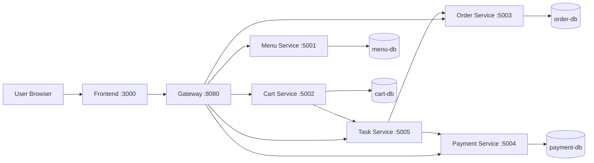

# Architecture Design

## 1. Pattern Selection

| Pattern                 | Selected? | Rationale                                                                         |
| ----------------------- | --------- | --------------------------------------------------------------------------------- |
| API Gateway             | Yes       | Single public endpoint and centralized routing/CORS                               |
| Database per Service    | Yes       | Keeps service ownership clear and reduces schema coupling                         |
| Saga / Process Manager  | Yes       | Task Service coordinates order and payment without distributed transactions       |
| Event-Driven Messaging  | No        | Assignment scope uses synchronous REST orchestration                              |
| Circuit Breaker / Retry | Partial   | Basic timeout/error handling at call sites; no dedicated resilience framework yet |

## 2. Components and Responsibilities

| Component       | Responsibility                                       | Technology                 |
| --------------- | ---------------------------------------------------- | -------------------------- |
| Frontend        | Display menu/cart and trigger checkout flow          | Nginx static + HTML/CSS/JS |
| Gateway         | Reverse proxy for all APIs under `/api/*`            | Nginx                      |
| Menu Service    | Manage and expose available menu items               | Spring Boot + JPA          |
| Cart Service    | Manage cart items and call Task Service for checkout | Spring Boot + JPA          |
| Order Service   | Create order and update order status                 | Spring Boot + JPA          |
| Payment Service | Process payment and persist payment result           | Spring Boot + JPA          |
| Task Service    | Orchestrate Saga for checkout and status tracking    | Spring Boot                |
| MySQL (menu)    | Menu Service data store                              | MySQL 8.4                  |
| MySQL (cart)    | Cart Service data store                              | MySQL 8.4                  |
| MySQL (order)   | Order Service data store                             | MySQL 8.4                  |
| MySQL (payment) | Payment Service data store                           | MySQL 8.4                  |

## 3. Communication Matrix

| From           | To              | Protocol | Purpose                              |
| -------------- | --------------- | -------- | ------------------------------------ |
| Frontend       | Gateway         | HTTP     | Access all APIs through one endpoint |
| Gateway        | Menu Service    | HTTP     | Proxy `/api/menu/*`                  |
| Gateway        | Cart Service    | HTTP     | Proxy `/api/cart/*`                  |
| Gateway        | Order Service   | HTTP     | Proxy `/api/order/*`                 |
| Gateway        | Payment Service | HTTP     | Proxy `/api/payment/*`               |
| Gateway        | Task Service    | HTTP     | Proxy `/api/task/*`                  |
| Cart Service   | Task Service    | HTTP     | Submit checkout saga request         |
| Task Service   | Order Service   | HTTP     | Create and update orders             |
| Task Service   | Payment Service | HTTP     | Process payment                      |
| Domain Service | Own MySQL       | JDBC     | Persist domain data                  |

## 4. High-level Architecture Diagram

## 5. Deployment View (Docker Compose)

Runtime topology:

- Application containers: `frontend`, `gateway`, `menu-service`, `cart-service`, `order-service`, `payment-service`, `task-service`
- Database containers: `menu-db`, `cart-db`, `order-db`, `payment-db`
- Networking: default Docker Compose network with service-name DNS
- Startup control: `depends_on` + DB health checks to ensure services wait for database readiness
- Configuration: environment variables in compose and `.env.example`

## 6. Risks and Trade-offs

| Decision                  | Benefit                                         | Trade-off                                         |
| ------------------------- | ----------------------------------------------- | ------------------------------------------------- |
| Synchronous REST Saga     | Easy to understand and demo                     | Coupling to service availability and latency      |
| Separate DB per service   | Strong ownership boundary                       | More operational overhead (multiple DB instances) |
| Randomized payment result | Demonstrates both success/failure paths quickly | Not production-realistic behavior                 |
| Nginx gateway             | Lightweight and simple routing                  | No built-in service discovery or policy engine    |
