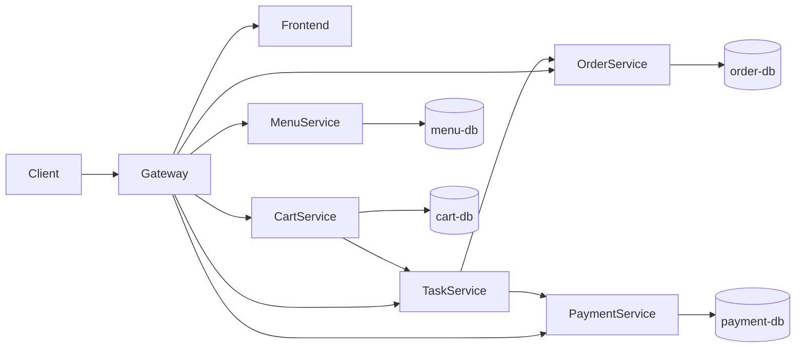

# Architecture Design

> This document captures architecture decisions for the selected process automation solution.

---

## 1. Pattern Selection

Select relevant architecture patterns and explain why they are used.

| Pattern                 | Selected? | Rationale                                                                         |
| ----------------------- | --------- | --------------------------------------------------------------------------------- |
| API Gateway             | Yes       | Cung cấp điểm vào duy nhất cho client, đơn giản hóa routing và CORS               |
| Database per Service    | Yes       | Mỗi service sở hữu dữ liệu riêng, giảm coupling schema                            |
| Saga / Process Manager  | Yes       | Task Service điều phối checkout mà không cần distributed transaction              |
| Event-Driven Messaging  | No        | Scope hiện tại sử dụng orchestration REST đồng bộ để dễ demo                      |
| Circuit Breaker / Retry | Partial   | Có xử lý lỗi cơ bản ở service call, chưa sử dụng framework resilience chuyên biệt |

---

## 2. Components & Responsibilities

List logical components in your system.

| Component       | Responsibility                                                 | Technology                 |
| --------------- | -------------------------------------------------------------- | -------------------------- |
| Frontend        | Hiển thị menu, giỏ hàng, checkout và trạng thái xử lý          | Nginx static + HTML/CSS/JS |
| Gateway         | Định tuyến `/api/*` đến các backend service                    | Nginx                      |
| Menu Service    | Quản lý và cung cấp dữ liệu món ăn                             | Spring Boot + JPA          |
| Cart Service    | Quản lý giỏ hàng và gửi yêu cầu checkout                       | Spring Boot + JPA          |
| Order Service   | Tạo đơn và cập nhật trạng thái đơn                             | Spring Boot + JPA          |
| Payment Service | Xử lý thanh toán và lưu kết quả                                | Spring Boot + JPA          |
| Task Service    | Điều phối Saga checkout và tra cứu trạng thái theo `requestId` | Spring Boot                |
| Menu DB         | Lưu dữ liệu menu                                               | MySQL 8.4                  |
| Cart DB         | Lưu dữ liệu giỏ hàng                                           | MySQL 8.4                  |
| Order DB        | Lưu dữ liệu đơn hàng                                           | MySQL 8.4                  |
| Payment DB      | Lưu dữ liệu thanh toán                                         | MySQL 8.4                  |

---

## 3. Communication Matrix

How services interact.

| From           | To              | Protocol | Purpose                                 |
| -------------- | --------------- | -------- | --------------------------------------- |
| Frontend       | Gateway         | HTTP     | Gọi API thông qua một endpoint duy nhất |
| Gateway        | Menu Service    | HTTP     | Proxy `/api/menu/*`                     |
| Gateway        | Cart Service    | HTTP     | Proxy `/api/cart/*`                     |
| Gateway        | Order Service   | HTTP     | Proxy `/api/order/*`                    |
| Gateway        | Payment Service | HTTP     | Proxy `/api/payment/*`                  |
| Gateway        | Task Service    | HTTP     | Proxy `/api/task/*`                     |
| Cart Service   | Task Service    | HTTP     | Gửi checkout payload để khởi tạo saga   |
| Task Service   | Order Service   | HTTP     | Tạo đơn và cập nhật trạng thái đơn      |
| Task Service   | Payment Service | HTTP     | Xử lý thanh toán                        |
| Domain Service | Own DB          | JDBC     | Đọc/ghi dữ liệu theo từng service       |

---

## 4. High-level Architecture Diagram

---

## 5. Deployment View (Docker Compose)

Describe runtime topology.

- Containers:
  - frontend
  - gateway
  - menu-service
  - cart-service
  - order-service
  - payment-service
  - task-service
  - menu-db
  - cart-db
  - order-db
  - payment-db
- Network: default compose network (`app-network`)
- Environment variables: configured in `.env` and `docker-compose.yml`

---

## 6. Risks and Trade-offs

| Decision                | Benefit                                   | Trade-off                                               |
| ----------------------- | ----------------------------------------- | ------------------------------------------------------- |
| REST Saga orchestration | Dễ hiểu, dễ debug, phù hợp bài demo       | Độ phụ thuộc availability giữa các service tăng         |
| Database per Service    | Ràng buộc ownership rõ ràng, dễ mở rộng   | Vận hành nhiều DB tăng độ phức tạp                      |
| Nginx Gateway           | Nhẹ, cấu hình đơn giản, dễ triển khai     | Không có service discovery/rate limit nâng cao mặc định |
| Random payment outcome  | Demo được cả nhánh thành công và thất bại | Không phản ánh hành vi thanh toán thực tế               |
